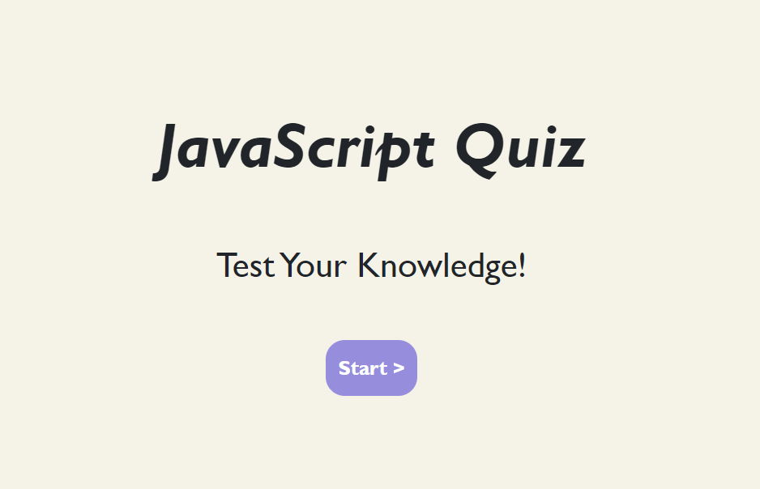
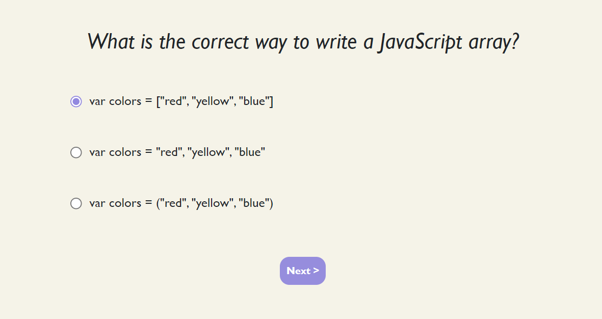
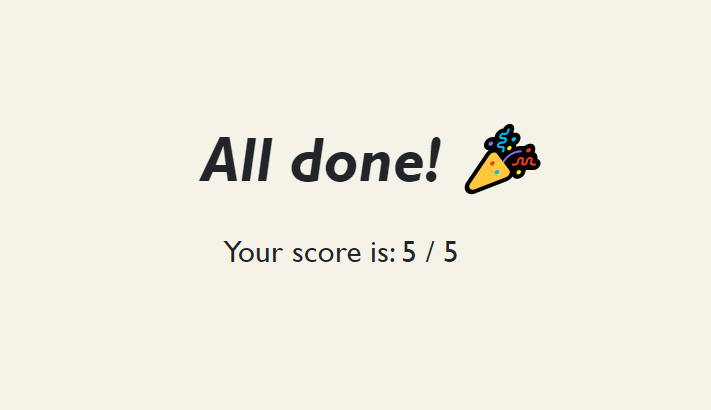

# JavaScript Quiz

## Description

A simple randomised JavaScript quiz.

## Installation
N/A

## Usage

To access this application, go to: https://codri5.github.io/javascript-quiz.

A series of random JavaScript questions will be displayed. 

Select your answers for each question and check your score at the end.

## Screenshots

## Credits

N/A

## License

Please refer to the LICENSE in the repo.
